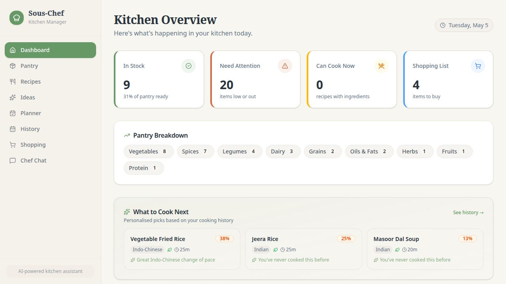
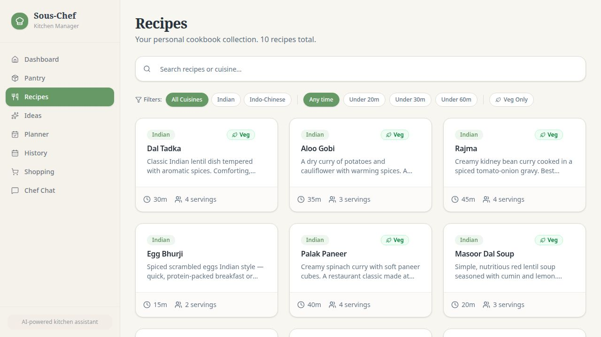
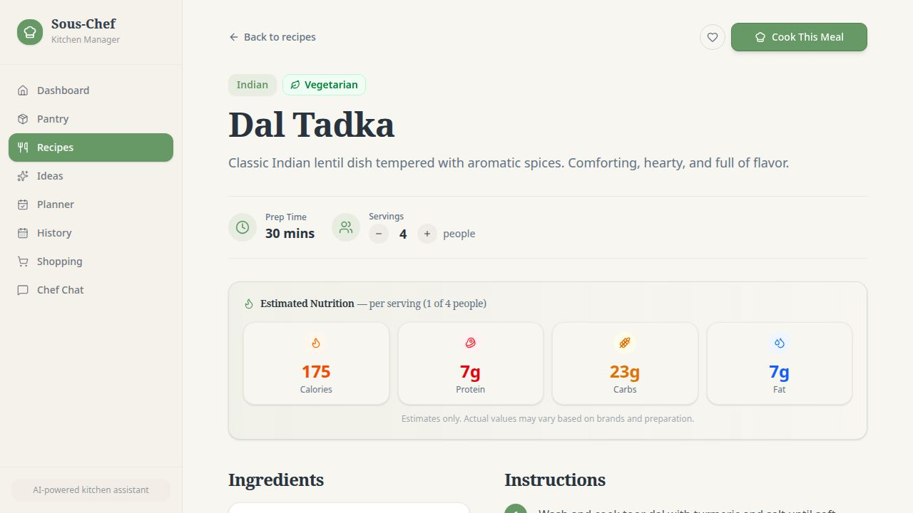
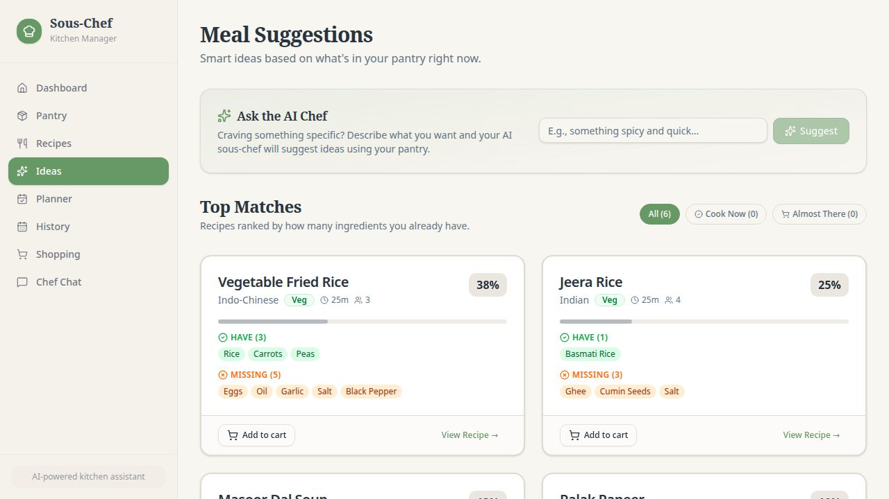
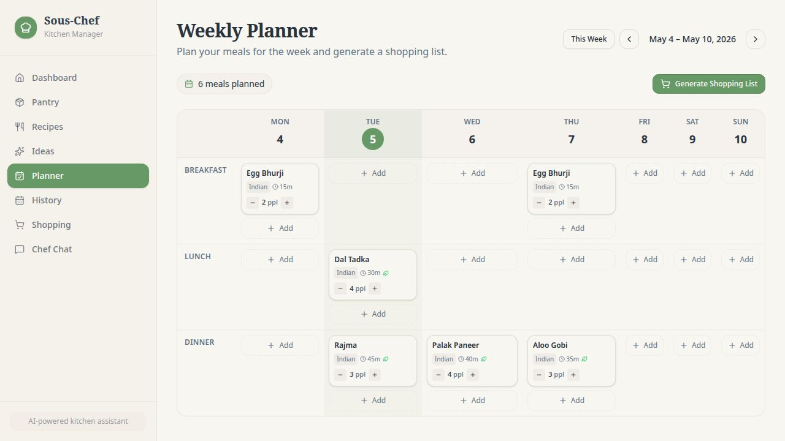
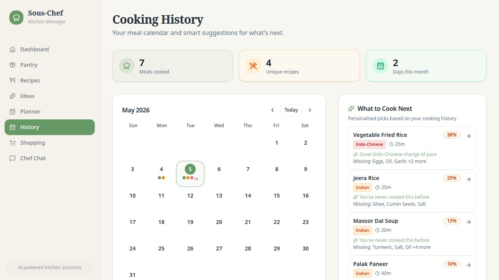
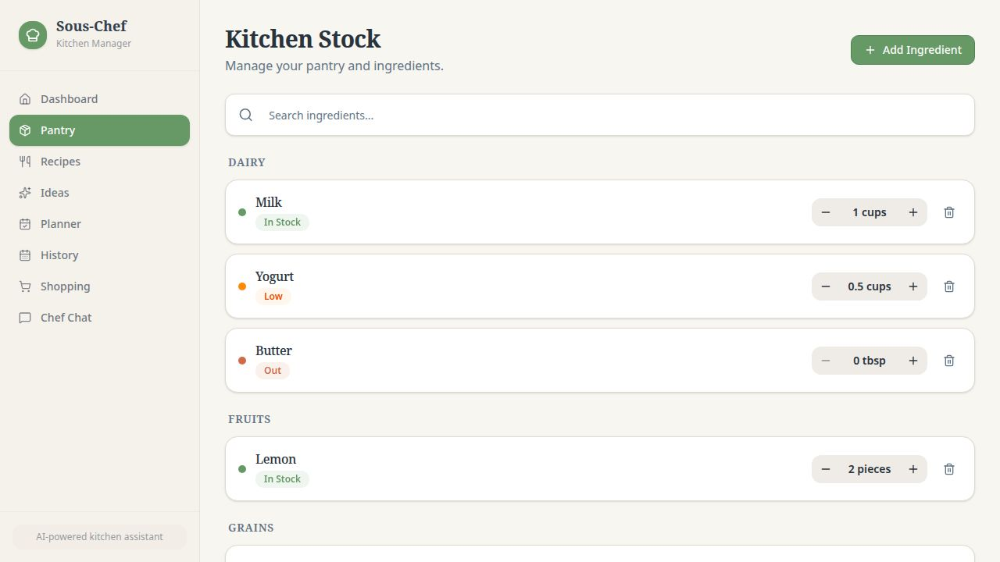
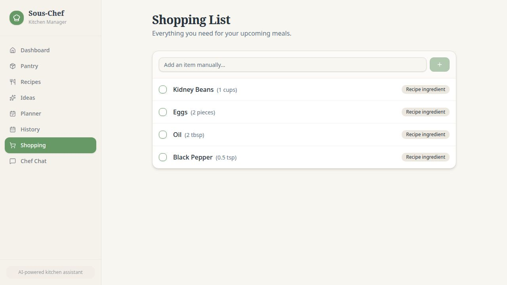

# Sous-Chef — Smart Kitchen Manager

A full-stack AI-powered kitchen management web app that tracks your pantry, suggests meals based on available ingredients, plans your week, and keeps your cooking history — all in one place.

---

## Screenshots

### Dashboard

*Live kitchen overview with pantry stats, low-stock alerts, recent activity, and AI-powered "What to Cook Next" suggestions personalised to your cooking history.*

---

### Recipes

*Your personal cookbook with search, cuisine filters, prep-time filters, vegetarian toggle, and favourite bookmarking.*

---

### Recipe Detail — with Nutrition & Serving Scaler

*Full recipe view with step-by-step instructions, an interactive serving-size scaler (1–20 people), and an estimated nutrition panel (calories, protein, carbs, fat) that updates in real time as you adjust servings.*

---

### Meal Ideas (AI Suggestions)

*Smart pantry-matched suggestions ranked by ingredient availability. Each card shows exactly what you have vs. what's missing, with a progress bar, "Add to cart" shortcut, and an "Ask the AI Chef" box powered by Claude.*

---

### Weekly Planner

*Drag-and-drop-style Mon–Sun × Breakfast/Lunch/Dinner grid. Click any cell to pick a recipe, adjust servings per meal, and hit "Generate Shopping List" to get a colour-coded ingredient breakdown comparing what you need against your pantry stock — with one-click "Add missing to cart".*

---

### Cooking History Calendar

*Monthly calendar showing every day you cooked with coloured meal dots. Click a day to see the detail. The right panel shows personalised "What to Cook Next" picks with variety-based reasoning ("Great Indo-Chinese change of pace", "You've never cooked this before").*

---

### Pantry / Kitchen Stock

*Manage all your ingredients grouped by category (Dairy, Fruits, Grains, Spices…). Each item shows its stock status (In Stock / Low / Out) with quick +/− controls.*

---

### Shopping List

*Consolidated shopping list fed by recipe suggestions, the weekly planner, and manual additions. Check off items as you shop.*

---

## Features

| Feature | Details |
|---|---|
| **Pantry Tracking** | Add ingredients, adjust quantities with +/− controls, status badges (In Stock / Low / Out), grouped by category |
| **Recipe Cookbook** | 10+ built-in recipes with search, cuisine & prep-time filters, vegetarian filter, favourites (saved to browser) |
| **Serving Scaler** | Scale any recipe from 1–20 people; ingredient quantities and nutrition estimates update live |
| **Nutrition Estimator** | Client-side nutrition database covering 70+ common ingredients; shows calories, protein, carbs, fat per serving |
| **AI Meal Suggestions** | Ingredient-matching engine ranks all recipes by pantry availability; Claude AI generates freeform suggestions from a custom prompt |
| **Smart "Next Meal"** | Variety-scoring algorithm avoids recently cooked dishes, boosts underrepresented cuisines, and explains each pick |
| **Weekly Meal Planner** | Mon–Sun × Breakfast/Lunch/Dinner grid; per-meal servings control; shopping list generation with pantry comparison |
| **Cooking History** | Monthly calendar of every meal cooked; click-to-detail; recent cooking log with timestamps and serving info |
| **Shopping List** | Auto-populated from recipes and planner; manual additions; check off items; links back to pantry restock |
| **AI Chef Chat** | Streaming chat with Claude; context-aware of your current pantry stock |
| **Mobile Ready** | Bottom tab navigation on mobile; responsive grid layout throughout |

---

## Tech Stack

### Frontend
- **React 18** + **TypeScript** — component-based UI
- **Vite** — fast dev server and build tool
- **Wouter** — lightweight client-side routing
- **TanStack Query** — server state management and caching
- **Tailwind CSS** + **shadcn/ui** — design system and component library
- **date-fns** — date formatting and calendar logic
- **Lucide React** — icon set

### Backend
- **Node.js** + **Express** — REST API server
- **Drizzle ORM** — type-safe database queries
- **PostgreSQL** — persistent data store
- **Zod** — schema validation on API inputs/outputs
- **esbuild** — fast TypeScript bundling for the server

### AI
- **Anthropic Claude** (claude-sonnet) — AI meal suggestions and chef chat, via Replit AI Integrations proxy (streaming SSE)

### Monorepo
- **pnpm workspaces** — shared packages (`@workspace/db`, `@workspace/api-client-react`)
- **OpenAPI + Orval** — contract-first API with auto-generated React Query hooks
- Reverse proxy routes `/api` → API server, `/` → React app

---

## Pages

| Route | Page |
|---|---|
| `/` | Dashboard |
| `/stock` | Pantry / Kitchen Stock |
| `/recipes` | Recipe Cookbook |
| `/recipes/:id` | Recipe Detail |
| `/suggestions` | Meal Ideas |
| `/planner` | Weekly Meal Planner |
| `/history` | Cooking History Calendar |
| `/shopping` | Shopping List |
| `/chat` | AI Chef Chat |

---

## Database Schema

| Table | Purpose |
|---|---|
| `ingredients` | Master ingredient catalogue |
| `kitchen_stock` | Current pantry quantities and thresholds |
| `recipes` | Recipe metadata (name, cuisine, prep time, servings) |
| `recipe_ingredients` | Ingredient requirements per recipe |
| `meal_plans` | Weekly planner entries (date, meal type, recipe, servings) |
| `shopping_list` | Shopping cart items |
| `activity_log` | Audit log of cooking events and pantry changes |
| `conversations` + `messages` | AI chef chat history |
